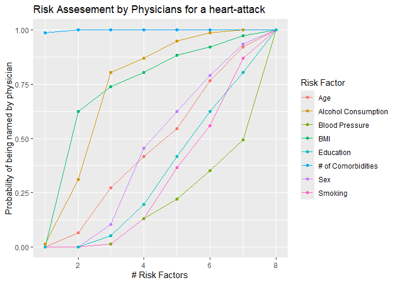

Mock exam: Einführung in die Statistische Software (R)
================
Stefanie Peschel, Philip Boustani
22 January 2025

Please first execute the following R Markdown code block:

``` r
renv::restore()
```

## Question 1: Reproducing a Plot (15 P.)

Run the following R Markdown code block:

``` r
load("Q1plot.RData")
Q1plot.png
```



Reproduce the plot “Q1plot.png” in your repository as accurately as
possible. Use `tidyverse` packages for preprocessing and `ggplot2` for
plotting if necessary. The raw data for the plot is stored in the file
`umfragen.Rds` in your repository.

Reproduction in German is acceptable.

## Background about the graphic

In the data collection process, thousands of medical professionals were
surveyed about what they consider to be the top X (1-8) risk factors for
a heart attack.

Up to 8 risk factors could be mentioned. Example:  
If only one risk factor could be mentioned (first row of the dataset),  
98.7013 percent of the doctors mentioned “Number of Comorbidities”
(`numberComorbidities`),  
and 1.298701 percent mentioned “Alcohol Consumption”
(`alcoholConsumption`).  
If the doctors were allowed to mention two risk factors (second row of
the dataset),  
all doctors mentioned “Number of Comorbidities,”  
while other risk factors were mentioned with varying frequencies, etc.

In the graph:  
- The X-axis shows the number of risk factors that could be mentioned.  
- The Y-axis shows the proportion of doctors who, given a specific
number of mentionable risk factors,  
mentioned one of the 8 possible risk factors.

### Your Code:

``` r
umfragen <- readRDS("umfragen.Rds")

# TODO
```

### Tests:

There are no tests for this task.

## Task 2: Temperature Conversion (15 points)

Write a function to convert temperatures between Celsius and
Fahrenheit  
(C -\> F and F -\> C).

The conversion is done as follows: - °C = (°F - 32) \* 5/9 (from
Fahrenheit to Celsius)  
- °F = °C \* 1.8 + 32 (from Celsius to Fahrenheit)

Ensure that all function arguments (inputs) accept only allowed values
and data types.  
The minimum allowed temperature is -459.67.

## Function Details

The function is named: `ex02temperature_conversion`.

### Input

- `temp`: Numeric vector without missing values. The temperature(s) to
  be converted.  
- `unit`: The unit in which `temp` is given. `"F"` for Fahrenheit or
  `"C"` for Celsius.

### Output

A numeric vector (`numeric(n)`), containing the converted temperatures.

### Examples

``` r
ex02temperature_conversion(c(212, 32))
```

    ## [1] 100   0

``` r
ex02temperature_conversion(100, unit = "C")
```

    ## [1] 212

``` r
ex02temperature_conversion(-9, unit = "CC")
```

    ## Error in match.arg(unit, c("F", "C")): 'arg' should be one of "F", "C"

``` r
ex02temperature_conversion(-460)
```

    ## Error in ex02temperature_conversion(-460): Assertion on 'temp' failed: Element 1 is not >= -459.67.

### Your Code:

``` r
ex02temperature_conversion <- function(temp, unit = "F") {
  
  # TODO
  
}
```

### Tests:

(2.1) Basic: Your function correctly converts temperatures between
Celsius and Fahrenheit. (5 points)

``` r
test <- "2.1"; source("evaluate_test.R")
```

(2.2) Basic: Your function returns error messages for invalid inputs
(wrong unit or temperatures outside the physically meaningful range). (5
points)

``` r
test <- "2.2"; source("evaluate_test.R")
```

(2.3) Advanced: Your function correctly converts additional temperatures
and handles errors for invalid input formats (inconsistent specification
of units for vector inputs). (5 points)

``` r
test <- "2.3"; source("evaluate_test.R")
```

## Task 3: Purchasing Process (30 points)

Examine the data `SAP.Rds` containing the datasets `EKKO`, `EKPO`, and
`LFA1`,  
which originate from an SAP database.

The datasets (or tables) are connected via the columns:  
- “MANDT”, “EBELN” (`EKKO` and `EKPO`)  
- “MANDT”, “LIFNR” (`EKKO` and `LFA1`)

Specifically, we focus on a purchasing process where a company places
orders (“EBELN”) with order items (“EBELP”).  
Additional information about the orders and order items is available in
the tables `EKKO` and `EKPO`,  
while supplier information is contained in `LFA1`.

The file `SAP_Glossar.pdf` contains a description of all datasets and
variables included in the SAP database.

### Subtask A (15 points)

The column `NETWR` in `EKPO` is incorrectly formatted. Correct it so
that the database is standardized.

Create a new column `WAERS` that extracts the currency from the string
in `NETWR`.  
`NETWR` should only contain the numeric value without any currency
information.

There are four currencies: Euro, Pound, Dollar, and Yen.

The inconsistencies are as follows:  
- The currency sometimes appears before or after the amount.  
- There are sometimes spaces between the amount and the currency.  
- The use of text and symbols is inconsistent.

Each currency can appear in one of four ways:  
- Plain text (case-insensitive, e.g., yen or Yen)  
- Symbol (e.g., ¥)  
- International code (e.g., JPY)

The full list includes:

- USD
  - \$  
  - USD  
- Euro
  - EUR  
  - €  
  - euro  
- Yen
  - Yen  
  - JPY  
  - ¥  
- GBP
  - gbp  
  - £

You can follow this guide (though other approaches are also valid):

1.  Convert all strings in `NETWR` to lowercase.  
2.  Remove spaces from the strings (“trim” them).  
3.  Standardize the different expressions for each currency to “eur”,
    “usd”, “jpy”, and “gbp”.  
4.  Convert the expressions to uppercase: “EUR”, “USD”, “JPY”, and
    “GBP”.  
5.  Split `NETWR`: Extract the currency into a new column `WAERS`.  
6.  Remove the currency strings from `NETWR`.  
    *Hint*: The regular expression for “anything except numbers” is
    `[^0-9.-]`.  
7.  Ensure that `NETWR` is numeric.

Save the improved `EKPO` table as `ex0303a`.

#### Your Code:

``` r
ex0303a <- NULL
```

#### Tests:

(3.a) `ex0303a` is a dataframe with correct dimensions, column names,
sums, and frequency values in the numeric columns. (15 points)

``` r
test <- "3.1"; source("evaluate_test.R")
```

### Subtask B (15 points)

Regardless of your result in a), use the columns provided in the file
`NETWR.Rds`  
as the new values for `NETWR` and `WAERS` (i.e., overwrite the
corresponding columns  
in `EKPO` with the columns from `NETWR.Rds`).

Calculate the total order value per supplier (`LIFNR`) for orders placed
(`AEDAT`)  
before July 3, 2021, and paid in Euros (you will also need the `EKKO`
dataset  
from the `SAP` object).

Save the resulting object as `ex0303b`.  
The created table `ex0303b` should consist of two columns: `LIFNR` and
`NETWR`.

#### Your Code:

``` r
ex0303b <- NULL
```

#### Tests:

(3.b) `ex0303b` is a dataframe with correct dimensions, column names,
sums, and frequency values in the numeric columns. (15 points)

``` r
test <- "3.2"; source("evaluate_test.R")
```

## Task 4: Runner (45 points)

You will implement the game “Runner”.  
The game is played with a deck of cards consisting of four suits:

- “Diamonds”  
- “Hearts”  
- “Spades”  
- “Clubs”

Each suit contains cards numbered from 1 to 15.

The game rules are as follows:

- The game can be played with one dealer and one to five players.  
- The game starts when the dealer draws a card from the deck.  
- The dealer asks the first player whether the current card has a
  higher, lower, or the same number as the previous card.  
- The player earns 1 point if they guess correctly, and loses 1 point if
  they guess incorrectly.  
- The card that the previous player guessed is now the card the next
  player has to guess.  
- The game continues until there are no cards left in the deck.

### Subtask A (5 points)

Create a `data.frame` that serves as the data basis to display all 60
cards  
in the deck, ensuring that each card is uniquely identifiable.  
Name the `data.frame` `ex04adeck`.  
Name the columns `colour` and `number`.

#### Your Code:

``` r
ex04adeck <- NULL
```

#### Tests:

(4.a) `ex04adeck` is a dataframe with correct dimensions, column names,
sums, and frequency values in the numeric columns. (5 points)

``` r
test <- "4.1"; source("evaluate_test.R")
```

### Subtask B (5 points)

This is your starter deck.  
For technical reasons, we also need to keep track of the current card
and the history of cards.  
These slots will remain empty initially.

Create a list named `ex04bdeck` containing the entries with the names  
`card`, `deck`, and `history`.  
Since the game has not started yet, `card` and `history` should be
empty.

#### Your Code:

``` r
ex04bdeck <- NULL
```

#### Tests:

(4.b) `ex04bdeck` is a list with the entries `card`, `history` and
`deck` where `deck` is a dataframe with correct dimensions, column
names, sum and frequency values and frequency values in the numerical
columns. (5 P.)

``` r
test <- "4.2"; source("evaluate_test.R")
```

### Teilaufgabe C (20 P.)

Implementieren Sie ein Ziehen aus dem Deck als eine `R` Funktion.

Ihre Funktion sollte eine benannte Liste zurückgeben, bei der der erste
Eintrag die Reihe ist, die aus dem Deck gezogen wurde, und der zweite
Eintrag das verbleibende Deck ohne die gezogene Karte ist.

Der Verlauf (history) entspricht allen Karten, die aus dem Deck gezogen
wurden, in chronologischer (absteigender) Reihenfolge.

Alle Einträge sollten, wenn nicht leer, den gleichen Typ/die gleiche
Klasse haben. Die Einträge sollten “card” und “deck”, “history” genannt
werden. Nennen Sie die Funktion `ex04draw`.

Sie benutzt das “Deck” als Eingabe und hat ein optionales Seed argument.
Die Eingabe “deck” sollte das gleiche Format haben wie die Ausgabe.

Stellen Sie sicher, dass der Seed nur gesetzt wird, wenn er angegeben
wird, so dass die Funktion standardmäßig zufällig arbeitet. Verwenden
Sie die bereitgestellte Signatur.

#### Eingabe

- `deck`: Eine Liste, die den Anforderungen für ein Deck aus b)
  entspricht.
- `seed`: Numerisches Skalar. Der optionale Seed für das Generieren von
  Zufallszahlen.

#### Ausgabe

Ein `deck`, mit einer Karte weniger in `$deck` im Vergleich zum Input.
Die entfernte Karte wird in `$card` als ein `data.frame` mit einer Zeile
dargestellt.

#### Examples

``` r
example_deck <- list(
  card = NULL,
  deck = data.frame(colour = c("black", "orange", "white", "black"),
                    number = c(8, 9, 1, 3)),
  history = NULL)
ex04draw(example_deck, seed = 8L)
```

    ## $card
    ##   colour number
    ## 4  black      3
    ## 
    ## $deck
    ##   colour number
    ## 1  black      8
    ## 2 orange      9
    ## 3  white      1
    ## 
    ## $history
    ## NULL

``` r
example_deck <- list(
  card = NULL,
  deck = data.frame(colour = c("black", "orange", "white", "black"),
                    number = c(8, 9, 1, 3),
                    irrelevant = c("A", "A", "C", "D")),
  history = NULL)
ex04draw(example_deck, seed = 8L)
```

    ## $card
    ##   colour number irrelevant
    ## 4  black      3          D
    ## 
    ## $deck
    ##   colour number irrelevant
    ## 1  black      8          A
    ## 2 orange      9          A
    ## 3  white      1          C
    ## 
    ## $history
    ## NULL

``` r
example_deck <- list(
  card = data.frame(colour = "green", number = 12),
  deck = data.frame(colour = c("black", "orange", "white", "black"),
                    number = c(8, 9, 1, 3)),
  history = NULL)
ex04draw(example_deck, seed = 8L)
```

    ## $card
    ##   colour number
    ## 4  black      3
    ## 
    ## $deck
    ##   colour number
    ## 1  black      8
    ## 2 orange      9
    ## 3  white      1
    ## 
    ## $history
    ##   colour number
    ## 1  green     12

#### Your Code:

``` r
ex04draw <- function(deck, seed = NULL) {
  
  #TODO
  
}
```

#### Tests:

(4.c.1) Your function `ex04draw` draws the card correctly, updates the
remaining remaining deck correctly and leaves the history as NULL if the
deck is fresh and no previous deck is fresh and no previous card has
been drawn. (5 P.)

``` r
test <- "4.31"; source("evaluate_test.R")
```

(4.c.2) Your function `ex04draw` draws the card correctly, updates the
remaining deck remaining deck correctly and moves the previous card from
card to the history history if a card has already been drawn. (5 P.)

``` r
test <- "4.32"; source("evaluate_test.R")
```

(4.c.3) Your function `ex04draw` draws the card correctly, updates the
remaining deck correctly, ignores irrelevant deck correctly, ignores
irrelevant columns and leaves the history as NULL if no previous card
was drawn. as NULL if no previous card was drawn. (5 P.)

``` r
test <- "4.33"; source("evaluate_test.R")
```

(4.c.4) Your function `ex04draw` draws the map randomly and produces
reproducible results when a seed is specified. (5 P.)

``` r
test <- "4.34"; source("evaluate_test.R")
```

### Teilaufgabe D (15 P.)

Implementieren Sie die Entscheidung eines spielenden Individuums, das
seine Entscheidung auf die vorherige (vor Beginn des Spiels) Verteilung
der Zahlen stützt, d.h. das Individuum wird immer “größer” spielen, wenn
eine Zahl kleiner als 8 erscheint und “kleiner”, wenn sie größer ist. Im
Falle von 8 ist die Person unentschieden und trifft eine zufällige
Entscheidung zwischen den gleich wahrscheinlichen Ereignissen (aus ihrer
Sicht).

Die Funktion nimmt die `card` (die Karte, über die entschieden werden
soll) und das `deck` (das verbleibende Deck zum Zeitpunkt der
Entscheidung) als Eingaben.

Nennen Sie die Funktion `ex04decide_prior`.

Die Funktion gibt einen skalaren Zeichenwert aus: “larger”, “equal” oder
smaller” (die getroffene Entscheidung). Verwenden Sie die
bereitgestellte Signatur.

#### Input

- `card`: A `data.frame` with one row and (at least) two columns:
  `colour` and `number`.  
- `deck`: A `data.frame` with any number of rows and (at least) two
  columns: `colour` and `number`.

#### Output

A scalar character: either `"smaller"` or `"larger"` according to the
rules provided.

#### Examples

``` r
example_deck <- list(
 card = data.frame(colour = "green", number = 12),
 deck = data.frame(colour = c("black", "orange", "white", "black"),
                   number = c(8, 9, 1, 3)),
 history = NULL)
ex04decide_prior(card = example_deck$card, deck = example_deck$deck)
```

    ## [1] "smaller"

``` r
example_deck <- list(
 card = data.frame(colour = "green", number = 4),
 deck = data.frame(colour = c("black", "orange", "white", "black"),
                   number = c(8, 9, 1, 3)),
 history = NULL)
ex04decide_prior(card = example_deck$card, deck = example_deck$deck)
```

    ## [1] "larger"

#### Your Code:

``` r
ex04decide_prior <- function(card, deck) {
  
  #TODO
  
}
```

#### Tests:

(4.d.1) Your function `ex04decide_prior` makes the correct decision
based on the given the correct decision as to whether the card drawn is
“smaller” or “larger” based on the given or “larger”, or makes a random
decision for a number of 8. (5 P.)

``` r
test <- "4.41"; source("evaluate_test.R")
```

(4.d.2) Your function `ex04decide_prior` ignores irrelevant inputs and
makes the correct decision the correct decision based on the given
distribution of numbers, whether the card drawn is “smaller” or
“larger”, or makes a random decision for a number of 8 makes a random
decision. (5 P.)

``` r
test <- "4.42"; source("evaluate_test.R")
```

(4.d.3) Your function `ex04decide_prior` also makes the correct
decisions for additional tests correct decisions (“smaller”, “larger”)
based on the given distribution of the numbers distribution of the
numbers and decides randomly on a number of 8. (5 p.)

``` r
test <- "4.43"; source("evaluate_test.R")
```

## Submit your exam (Important!)

Submit your code by pushing your results via Git.

1)  Open the `Git` window.
2)  Click on the `Commit` button.
3)  Put a cross next to the document `exam.Rmd`.
4)  Enter any commit message.
5)  Click on `Commit`.
6)  Press `Push`.

## Run all tests

``` r
EXERCISES <- character(0); source("evaluate_submission.R")
```
